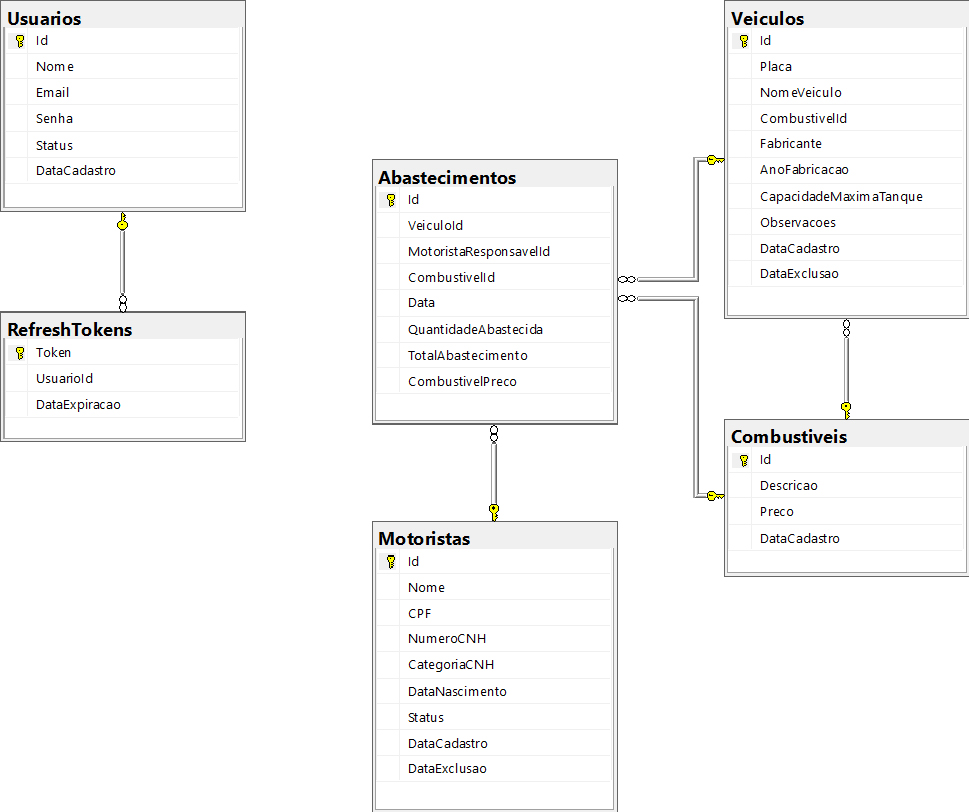

# Bitzen
O projeto backend foi desenvolvido na arquitetura CQRS, utilizando ASP.NET CORE 7 C#. 

Quando executado pelo Visual Studio, irá iniciar a API com o Swagger (Bitze.API), e em paralelo, executará o frontend (Bitzen.Web).

**Dados de acesso ao login:**

email: admin@btztransports.com.br

senha: admin

A autenticação e segurança da aplicação foi utilizado o JWT Token Bearer.

**Script do Banco de dados:**
[Banco de dados](https://github.com/ralpharada/bitzen/database/script.sql)

**DER do Banco de Dados**

